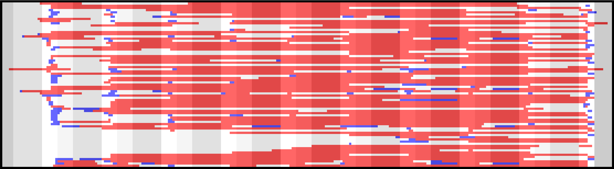
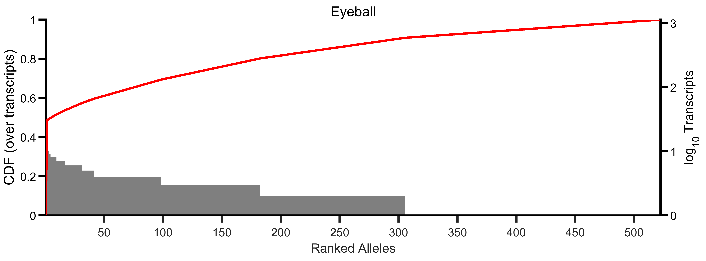
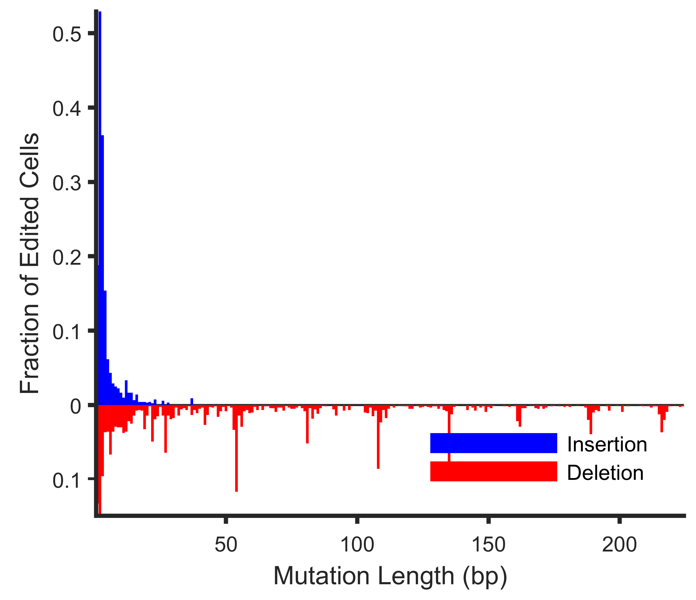
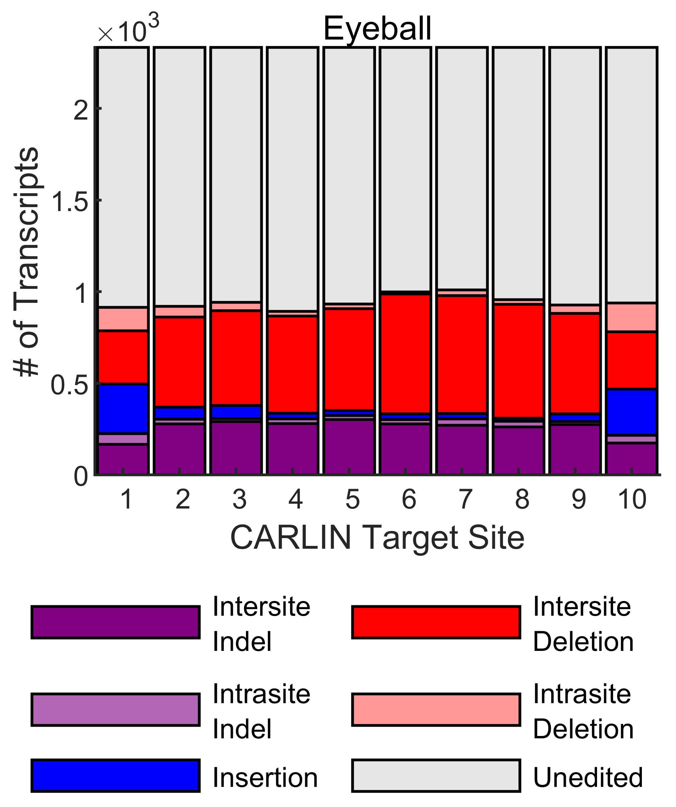
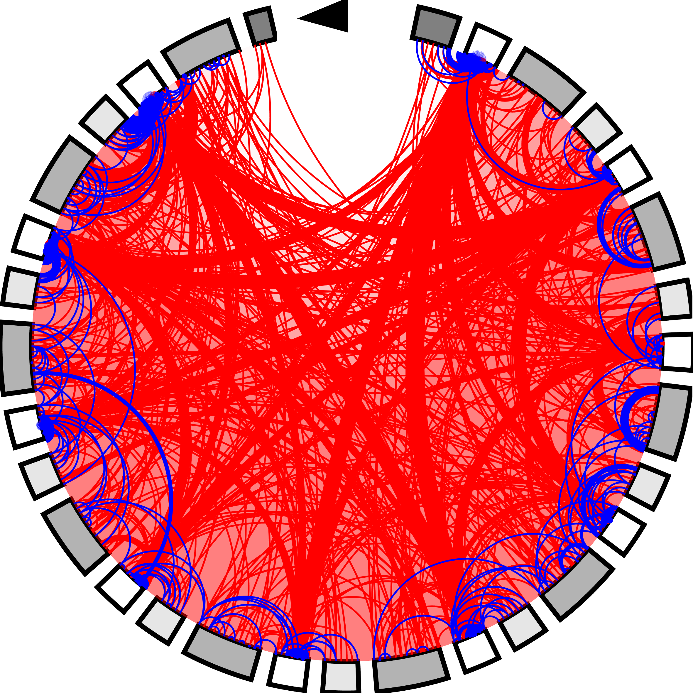

# CARLIN Pipeline

The CARLIN pipeline calls alleles from sequencing runs of the CARLIN amplicon. It was written in MATLAB 2019a.

## Citation

Please cite the [companion paper](https://doi.org/10.1016/j.cell.2020.04.048) if you use this software package:

> S. Bowling*, D. Sritharan*, F. G. Osorio, M. Nguyen, P. Cheung, 
A. Rodriguez-Fraticelli, S. Patel, W-C. Yuan, Y. Fujiwara, B. E. Li, S. H. Orkin, 
S. Hormoz, F. D. Camargo. "An Engineered CRISPR-Cas9 Mouse Line for 
Simultaneous Readout of Lineage Histories and Gene Expression Profiles 
in Single Cells." Cell (2020), https://doi.org/10.1016/j.cell.2020.04.048

To reproduce all the results and figures from the paper, please [visit the paper repository](https://gitlab.com/hormozlab/Cell_2020_carlin).

## Download

To download the pipeline into the directory given by CODE_PATH:

```bash
$ git clone https://gitlab.com/hormozlab/carlin.git CODE_PATH
```

## Installation

Install the CARLIN software by opening MATLAB, and running the following commands. Installation requires a C++ compiler, which should be included as part of your MATLAB installation if you are an academic user. If not, you can [download the free MinGW compiler](https://www.mathworks.com/support/requirements/supported-compilers.html).
	
```MATLAB
>> cd(CODE_PATH);
>> install_CARLIN;
```

If you are installing on your local machine, you should additionally save the path.

```MATLAB
>> savepath;
```

If you are installing on a cluster machine, the MATLAB path file will be read-only, so you will have to re-run the following command at the start of each session to set up paths:

```MATLAB
>> addpath(genpath(CODE_PATH));
```

You should also re-run the installation when you pull new changes from git.

## Usage

The entry point to the pipeline is the `analyze_CARLIN` function.

```MATLAB
>> help analyze_CARLIN 
```

    analyze_CARLIN calls alleles from FASTQs sequencing the CARLIN amplicon. 
 
    analyze_CARLIN(FASTQ_FILE, CFG_TYPE, OUTDIR) analyzes FASTQ_FILE 
    (*.fastq, *.fastq.gz) generated according to the experimental CARLIN
    protocol defined in CFG_TYPE (one of 'Sanger', 'BulkDNA', 'BulkRNA', 
    'scInDropsV2', 'scInDropsV3', 'sc10xV2', 'sc10xV3') and saves the 
    following files to OUTDIR:

    Analysis.mat.gz - contains all variables including a compactified 
      representation of the FASTQ files, a depot of unique aligned
      sequences, the collection of CBs and UMIs detected before and after 
      denoising, and the called alleles. This file may be large, and is not
      intended for use by a casual user. Rather, it stores all intermediate 
      variables for custom one-off analysis.

    Summary.mat - contains the subset of variables in Analysis.mat that 
      is usually sufficient for subsequent downstream analysis
      including a list of alleles, their frequencies, tags (UMIs or CBs) 
      reporting that allele, input parameters, thresholds used by the 
      algorithm, and, for SC runs, the reference barcode list.

    Alleles.png - Plot of mutations harbored in each allele, distribution of 
      allele occurrence frequencies and summary statistics.

    AlleleAnnotations.txt - Annotations describing each allele in plaintext
      format (HGVS) for use by other downstream tools.

    AlleleColonies.txt - List of tags (UMIs or CBs) which report each
      allele, for use by other downstream tools. The ordering corresponds 
      to AlleleAnnotations.txt

    Results.txt - Human-readable summary of the analysis results.

    Diagnostic.png - Detailed dashboard of various diagnostic quantities.

    Warnings.txt - List of issues detected in the data.

    Log.txt - Running log of the pipeline.

    The pipeline can optionally be invoked with some extra paramters:

    analyze_CARLIN(..., 'CARLIN_amplicon', CARLIN_def) uses the nucleotide
    sequence and alignment parameters in 'CARLIN_def' to define the CARLIN
    amplicon and align reads against it. Defaults to 'OriginalCARLIN', which 
    corresponds to the amplicon used in the (Cell, 2020) paper. Can also 
    specify 'TigreCARLIN'. See *.json files in cfg/amplicon for full definitions. 

    analyze_CARLIN(..., 'read_cutoff_UMI_denoised', cutoff) uses a minimum
    read threshold of 'cutoff' when attempting to call alleles from denoised 
    UMIs (default = 10). This cutoff is not used in its raw form, but
    combined as part of a cutoff function. It represents an absolute floor,
    but the cutoff used in practice will generally be higher.

    analyze_CARLIN(..., 'read_override_UMI_denoised', cutoff) short circuits
    the cutoff function, and sets the threshold to 'cutoff'. All UMIs with a
    read count >= 'read_override_UMI_denoised' will be asked to call an allele. 
    Default is unset.

    For bulk sequencing runs (CFG_TYPE='Bulk*'):

    analyze_CARLIN(..., 'max_molecules', N) considers (at most) the N denoised
    UMIs with the most reads, for calling alleles. For CFG_TYPE='BulkDNA',
    N is the number of cells in the sample. For CFG_TYPE='BulkRNA', N is the 
    number of transcripts (if unsure, 10x the number of cells is a suitable
    guess). Default is inf.
    
    For single-cell sequencing runs of the CARLIN amplicon (CFG_TYPE='sc*'):

    analyze_CARLIN(..., 'max_cells', N) considers (at most) the N denoised
    cell barcodes with the most reads, for calling alleles. Defaults to 
    the number of possible CBs in the single-cell platform specified by
    CFG_TYPE, or the number of elements in 'ref_CB_file' (see below), if
    specified.

    analyze_CARLIN(..., 'read_cutoff_CB_denoised', cutoff) uses a minimum
    read threshold of 'cutoff' when attempting to call alleles from denoised 
    CBs (default = 10). This cutoff is not used in its raw form, but
    combined as part of a cutoff function. It represents an absolute floor,
    but the cutoff used in practice will generally be higher.

    analyze_CARLIN(..., 'read_override_CB_denoised', cutoff) short circuits
    the cutoff function, and sets the threshold to 'cutoff'. All CBs with a
    read count >= 'read_override_CB_denoised' will be asked to call an allele. 
    Default is unset.

    analyze_CARLIN(..., 'ref_CB_file', file) uses the reference list of 
    cell barcodes in the file specified by 'ref_CB_file' when denoising 
    barcodes found in the FASTQ files. The reference list should have one 
    cell barcode per line. Each cell barcode should be a string consisting 
    of only the characters {A,C,G,T}. The length of the barcode should match
    the length expected by the platform specified by CFG_TYPE. This reference
    list is typically produced by the software used to process the 
    corresponding transcriptome run. Defaults to the full barcode list in 
    the single-cell platform specified by CFG_TYPE. Specifying a reference
    list leads to more accurate denoising than using the full barcode list.

    Examples:

        % Run analysis on bulk RNA sample
        analyze_CARLIN('run1/PE.fastq.gz', 'BulkRNA', 'run1_output');

        % Run analysis on multiple sequencing runs of the same bulk DNA sample
        analyze_CARLIN({'run1/PE.fastq.gz'; run2/PE.fastq.gz'}, 'BulkDNA', 'combined_output');

        % Run analysis on sample prepared with InDropsV3
        analyze_CARLIN('indrops/amplicon/Lib1.fastq', 'scInDropsV3', ...
                       'output', 'ref_CB_file', 'indrops/transcriptome/abundant_barcodes.txt');

        % Run analysis on sample prepared with 10xGenomics V2
        analyze_CARLIN({'tenx/amplicon/Mouse_R1_001.fastq', 'tenx/amplicon/Mouse_R2_001.fastq'}, ...
                       'sc10xV2', 'tenx/processed_amplicon', ...
                       'ref_CB_file', 'tenx/transcriptome/filtered_barcodes_umi_mt.txt');
                      
    Author: Duluxan Sritharan. Hormoz Lab. Harvard Medical School.


## Outputs

The outputs are described in the MATLAB help screen captured above. The most important output is `Summary.mat` which stores all the information that should typically be required for any downstream analysis. 

Each run of the pipeline also produces a summary plot, with useful at-a-glance metrics in the top-left corner:

<p align=center></p>

Here's a brief look at the text outputs from a sample run:

```bash
$ tail AlleleAnnotations.txt 
```
    50_157del,212_265del
    47_131del
    47A>T
    23_184del
    23_237del,262_267del
    23_23del,49_49delinsTC,104_105insCC,265_266insAC
    22_23insG,77_265del
    23_241del
    17_49delinsTCG,77_238del,266_266del
    17_150del,264_265del

```bash
$ head AlleleColonies.txt -n 20 | tail -n 10
```

    AATAGAGGTGAGACCA,CATACTTAGTCATCCA,CCTCAGTGTGCCTAAT,CGAAGGATCGTTCTGC,GAGATGGCAAAGGCTG,GGTGAAGCAACCCTAA,TCCTCTTTCACAGTGT
    AGATAGACAGCACCCA,GCGTTTCTCACAAGAA,GTAGTACTCAAAGCCT,GTGAGGATCTCGTCAC,GTGTAACAGAAACCCG,TAGGTTGTCACGATAC
    ATGGGAGTCATTACGG,CATTCTATCCGCACGA,GCTGAATGTGACACAG,GGGACCTGTCCTTAAG,TACGTCCCACCGGAAA,TTAGGCAAGCCACAAG
    CTCCACAGTGCGACAA,GCCAGGTGTTCCTAGA,GTAATCGTCATTGAGC,TGCTCGTCACACTTAG,TTCCGGTGTCATAACC
    CACCGTTGTGGACAGT,GAGTCTATCATTTACC,TGCTTGCTCGGTGAAG,TTCTAGTTCCACTTCG
    GACATCAGTGTCCCTT,TGCGGCAGTTATCCAG,TTCAGGAAGCTAGAAT,TTTCATGTCAACTACG
    GAACTGTTCGTGCTCT,TACCCACGTCACATTG,TCGATTTCATCCAATG,TTACCGCGTAATTAGG
    ACACAGTCATCGGAAG,CGTTGGGCAGATACCT,GCATTAGTCCCTTTGG
    AGGCTGCTCTCACTCG,ATGGGTTGTCTCGGGT,ATTCGTTCAACTCCCT
    CTAACCCAGCCTCACG,GTTACAGTCTATACTC,TGGATCACACAGCATT

```bash
 $ tail Results.txt
```

    ALLELES

    Total (including template):                                     83
    Singletons (including template):                                49
    % CBs edited:                                                   20
    Effective Alleles:                                              44
    Diversity Index (normalized by all):                          0.03
    Diversity Index (normalized by edited):                       0.17
    Mean CARLIN potential (by allele):                            5.24


```bash
$ cat Warnings.txt
```

    OFF-TARGET AMPLIFICATION

    Significant off-target amplification detected: 73% of reads are not CARLIN.

    REFERENCE_LIST

    Collapsing MiSeq cell barcodes against the platform's reference list may lead to more FPs and FNs.

    FILTERING

    Sequencing depth insufficent. Low number of reads detected in FASTQ.

    Only 61% of reads have usable provenance information (CB or UMI). See Results.txt for a more detailed breakdown of QC issues.

    ANALYSIS

    Number of common CBs is low (163). This is likely due to:
    - reads dedicated to FP CBs owing to the inflated reference list used
    - low sequencing depth so that many CBs do not exceed the required threshold
    - QC issues with CB/UMI which cause reads to be dedicated to spurious CBs that persist after filtering

    RESULTS

    Low +Dox induction detected. Only 0% of CBs reported an edited CARLIN allele.

    For allele(s) 1, >10% of CB halves or UMIs differ pairwise by only 1bp. This may indicate that that the cell count for these alleles is artificially inflated. This is likely because of QC issues on the CB/UMI reads. This is a known issue with InDrops.

## ExperimentSummary Object

Each run of the CARLIN pipeline produces an `ExperimentSummary` or `ExperimentReport` object saved in `Summary.mat` called `summary`. This is the only file needed for most common downstream analyses. The field `summary.alleles` contains a list of called CARLIN alleles sorted in descending order according to `summary.allele_freqs`, which indicates how many UMIs (for bulk experiments) or CBs (for single-cell experiments), each allele is found in.

## Analyzing Data Across Multiple Experiments

`ExperimentSummary` objects from separate experiments can be merged to analyze how alleles are shared across the experiments:

```MATLAB
>> mouse1 = load('Mouse1/Summary.mat');
>> mouse2 = load('Mouse2/Summary.mat');
>> mouse3 = load('Mouse3/Summary.mat');
>> [merged, sample_map, allele_breakdown_by_sample] = ExperimentSummary.FromMerge([mouse1.summary; mouse2.summary; mouse3.summary]);
```

`merged` is a new `ExperimentSummary` object that can be handled in the usual way for assessing statistical significance of alleles or preparing visualizations (see below). `sample_map{j}(i)` indicates which allele in `merged` corresponds to allele `i` in experiment `j`. `allele_breakdown_by_sample(i,j)` indicates how many times allele `i` in `merged` appeared in experiment `j`.

## Statistical Significance of Alleles

A main contribution of the CARLIN paper (Cell, 2020) is to quantify the statistical significance of alleles (see Methods). Cas9 editing does not generate all alleles with equal probability - those with complex editing patterns are more rare. The more common alleles are more likely to coincidentally mark multiple progenitors, and are therefore less useful for lineage tracing. Alleles that should be rare but are abundant in a particular experiment are statistically significant. 

Statistical significance is determined by comparing the observed frequency of an allele in an experiment, with the expected frequency. The observed frequency is stored in `summary.allele_freqs`. The expected frequency distribution can be determined by using the allele bank, (stored in the `Bank` variable of `Bank_OriginalCARLIN.mat`), which is the same bank used in Figure 3 of (Cell, 2020).

You can compute the two p-values described in Methods as shown:

```MATLAB	
>> load('Summary.mat');
>> load('Bank.mat');
>> p_clonal = bank.compute_clonal_pvalue(summary);
>> p_frequency = bank.compute_frequency_pvalue(summary);
```

The output in each case is a vector with elements corresponding to the alleles in `summary.alleles`.

## Create a Custom Bank

To create a custom bank characterizing the null distribution of allele frequencies for your own protocol, put `CatchAllCmdW` executable file into a desired directory and copy the full path (including the file name) into:

	CODE_PATH/@Bank/CatchAllPath.txt

Run the following code to create a `Bank` object by pooling three libraries (saved in directories `Mouse1`, `Mouse2`, and `Mouse3`), each processed separately using the CARLIN pipeline, and save the result in `MyCustomBank/Bank.mat`:

```MATLAB
>> mouse1 = load('Mouse1/Summary.mat');
>> mouse2 = load('Mouse2/Summary.mat');
>> mouse3 = load('Mouse3/Summary.mat');
>> bank = Bank.Create([mouse1.summary; mouse2.summary; mouse3.summary], {'Mouse1'; 'Mouse2'; 'Mouse3'}, 'MyCustomBank');
```

The CatchAll code runs only on Windows. You can use Windows emulators such as [VirtualBox](https://www.virtualbox.org) or [Wine](https://www.winehq.org) to run it on non-Windows machine. 

## Work with Mutations

A CARLIN allele is stored as two aligned strings - a sequence and a reference. To view the alignment of the fifth most common allele in the experiment:

```MATLAB
>> [summary.alleles{5}.get_seq; summary.alleles{5}.get_ref]
  
    ans =

      2×276 char array
    
        'CGCCGGACTGCACGACAGTCGACGATGGAGTCGACACGACTCGCGCATA------------------------------------------------------------------------------------------------------------------------------------------------------------------------------------------------------------------------CGATGGGAGCT'
        'CGCCGGACTGCACGACAGTCGACGATGGAGTCGACACGACTCGCGCATACGATGGAGTCGACTACAGTCGCTACGACGATGGAGTCGCGAGCGCTATGAGCGACTATGGAGTCGATACGATACGCGCACGCTATGGAGTCGAGAGCGCGCTCGTCGACTATGGAGTCGCGACTGTACGCACACGCGATGGAGTCGATAGTATGCGTACACGCGATGGAGTCGAGTCGAGACGCTGACGATATGGAGTCGATACGTAGCACGCAGACGATGGGAGCT'
```

To retrieve a list of mutations called from a set of alleles, and inspect the second mutation in the thirteenth allele:

```MATLAB
>> mut_list = cellfun(@(x) Mutation.identify_cas9_events(summary.CARLIN_def, x), summary.alleles, 'un', false);
>> mut_list{13}(2)

    ans = 
    
      Mutation with properties:
    
             type: 'D'
        loc_start: 263
          loc_end: 266
          seq_new: '----'
          seq_old: 'AGAC'

>> mut_list{13}(2).annotate()

    ans =

        '263_266del'        
```

To output a list of mutations to a text file in HGVS format as shown in AlleleAnnotations.txt:

```MATLAB
>> Mutation.ToFile(summary.CARLIN_def, mut_list, 'output_path', 'mootations.txt');
```

To construct CARLIN alleles by applying mutations from a list specified in HGVS format (like AlleleAnnotations.txt) to the `CARLIN_amplicon` defined in CARLIN_def:

```MATLAB
>> alleles = cellfun(@(x) Mutation.apply_mutations(CARLIN_def, x), Mutation.FromFile(CARLIN_def, 'dootations.txt'), 'un', false);
```

## Visualization

This package also includes a few standard visualizations, that will produce figures like those shown in the (Cell, 2020) paper. They all take an `ExperimentSummary` object as input. You can change the color scheme by modifying the constants in plots/CARLIN_viz.m

Visualize the top 75 most common edited alleles:
```MATLAB
>> plot_highlighted_alleles(summary, 75);
```
<p align=center></p>

Generate a CDF and histogram of allele frequencies:
```MATLAB
>> plot_allele_frequency_CDF(summary, 'Eyeball');
```
<p align=center></p>

Generate a histogram of mutations according to length (normalized by the number of cells in the experiment):
```MATLAB
>> plot_indel_freq_vs_length(summary);
```
<p align=center></p>

Summarize the different edit patterns at each target site:
```MATLAB
>> plot_site_decomposition(summary, true, 'Eyeball', '# of Transcripts');
```
<p align=center></p>

Visualize the editing patterns in more detail:
```MATLAB
>> plot_stargate.create(summary);
```
<p align=center></p>

## Custom Configurations

The CARLIN pipeline allows limited scope for customization by allowing advanced users to specify their own configuration file, which tells the pipeline how reads from the input FASTQ file(s) should be interpreted. Since only the default configurations have been tested, we cannot guarantee that exotic configurations will work out-of-the-box. _**Caveat emptor**_.

To specify a custom configuration file set CFG_TYPE='PATH/TO/CustomCfg.json' when calling `analyze_CARLIN`. Instead of creating your configuration file from scratch, copy the existing default from CODE_PATH/cfg/library/*.json that most resembles your desired settings and make the required modifications.

The pipeline expects configuration files to have the following fields:

* type : {"Bulk", "SC"}

Are the FASTQs from "Bulk" experiments, in which reads are only tagged with UMIs, or from "SC" experiments, in which reads are also associated with CBs? If type="Bulk", the input FASTQ should contain paired-end reads, and the UMI should always be immediately 5' or 3' of the amplicon sequence (see UMI.location and read_perspective below). If type="SC", the software expects FASTQs in the exact format produced by either the CellRanger (10x) or [CARLIN_InDrops](https://gitlab.com/hormozlab/indrops) pipeline.

* SC.Platform : {"10x", "InDrops"}
* SC.Version : {2, 3}

Specify the FASTQ format when type="SC". Do not include if type~="SC".

* UMI.length : [whole number]

Specify the number of bps in a UMI.

* UMI.location : {"L", "R"}

When type="Bulk", is the UMI located to the left or right of the amplicon sequence in the read (before applying the transformations in read_perspective below)? Do not include if type="SC".

* CB.length : [whole number]

Specify the number of bps in a CB. Do not include if type~="SC".

* read_perspective.ShouldComplement : {"Y", "N"}
* read_perspective.ShouldReverse : {"Y", "N"}

Specify what transformations have to be performed on the lines of the input FASTQ file so that when read left-to-right, they match the reference sequence defined in the CARLIN_amplicon file (modulo mutations).

* trim.Primer5 : {"exact", "misplaced", "malformed", "ignore"}
* trim.Primer3 : {"exact", "misplaced", "malformed", "ignore"}
* trim.SecondarySequence: {"exact", "misplaced", "malformed", "ignore"}

After applying the transformations specified in read_perspective, the lines should have the following structure:

    || A | Primer5 | CARLIN | Secondary Sequence | Primer3 | B ||

The CARLIN sequence can therefore be extracted by searching for the flanking primers and/or secondary sequence according to various levels of stringency (from most to least):
    
1. "exact" discards a read unless an exact match is found at the precise location:
    
    * Primer5 : A=UMI when type="Bulk" and (UMI.location=="L")==(read_perspective.Reverse=="N"). A='' otherwise.
    * Primer3/SecondarySequence : B=UMI when type="Bulk" and (UMI.location=="L")~=(read_perspective.Reverse=="N"). B='' otherwise.

2. "misplaced" discards a read unless an exact match is found irrespective of location.

3. "malformed" discards a read unless nwalign with NUC44 scoring matrix and Glocal=true returns a score greater than or equal to the corresponding match_score specified in the CARLIN_amplicon file (see below).

4. "ignore" does not search for the specified sequence i.e. the sequence is treated as the empty string.

When type="Bulk", the UMI associated with each read is therefore considered to be the UMI.length bps to the left (right) of Primer5 (Primer3) when (UMI.location=="L")==(read_perspective.Reverse=="N") is true (false). To avoid registration of spurious UMIs due to poor alignment with the primers, it is best to set trim.Primer5={"exact","misplaced"} (trim.Primer3={"exact","misplaced"}) when type="Bulk".

## Custom CRISPR Sequences

The CARLIN pipeline allows limited scope for customization by allowing advanced users to supply their own CARLIN_amplicon file, which specifies the CRISPR nucleotide sequence defining the CARLIN amplicon and alignment parameters for aligning reads against this reference. Since only the default amplicons have been tested, we cannot guarantee that all CRISPR sequences will work out-of-the-box. _**Caveat emptor**_.

To specify a custom CARLIN_amplicon file, supply 'PATH/TO/CustomAmplicon.json' as the 'CARLIN_amplicon' argument when calling `analyze_CARLIN`. Instead of creating your CARLIN_amplicon file from scratch, copy one of the existing defaults from CODE_PATH/cfg/amplicon/*.json and make the required modifications.

The pipeline expects CARLIN_amplicon files to have the following fields:

* sequence.segments : ["N...N", ... , "N...N"]

An array of target sites as defined in Figure 1B of (Cell, 2020). All target sites must be the same length.

* sequence.pam : ["N...N", ... , "N...N"]

An array of PAM sequences as defined in Figure 1B of (Cell, 2020). The number of PAM sequences specified should be one less than the number of target sites and all PAM sequences must be the same length. If a single PAM sequence is specified, it will be repeated between all target sites. Specify an empty string if only one target site is specified in sequence.segments.

* sequence.{prefix,postfix} : "N...N"

A nucleotide sequence specifying the {prefix, postfix} as defined in Figure 1B of (Cell, 2020).

* sequence.{Primer5,Primer3,SecondaySequence} : "N...N"

A nucleotide sequence specifying the {5' Primer, 3' Primer, Secondary Sequence} (see diagram above).

* match_score.{Primer5,Primer3,SecondarySequence} : [double]

When the configuration file specifies trim.{Primer5,Primer3,SecondarySequence}="malformed", if nwalign with NUC44 scoring matrix and Glocal=true returns a score greater than or equal to this threshold when aligning the read to sequence.{Primer5,Primer3,SecondarySequence}, the primer/sequence is considered to be found in the read.

* {open_penalty,close_penalty}.{prefix,postfix} : [double array]

An array of length equal to sequence.{prefix,postfix} specifying the opening/closing penalty for the sequence. See Supplementary Table 2 and Methods of (Cell, 2020).

* {open_penalty,close_penalty}.pam : [[double array], ..., [double array]]

A 2D array specifying the opening/closing penalty for PAM sequences in sequence.pam. If a single array is specified, the same opening/closing penalty will be used for all PAM sequences. See Methods and Supplementary Table 2 of (Cell, 2020).

* {open_penalty,close_penalty}.{consites,cutsites} : [[double array], ..., [double array]]

A 2D array specifying the opening/closing penalty for conserved sites/cutsites in sequence.segments as defined in Figure 1B of (Cell, 2020). If a single array is specified, the same opening/closing penalty will be used for all target sites. The arrays must be of constant width, and the combined widths of the conserved site and cutsite penalties must match the number of bps in the target site. See Methods and Supplementary Table 2 of (Cell, 2020).

* open_penalty.init : [double]

Specify the opening insertion penalty. See Methods and Supplementary Table 2 of (Cell, 2020).

Each `ExperimentSummary` object contains a `CARLIN_def` field that stores information about the `CARLIN_amplicon` used when running the pipeline. You can only merge `ExperimentSummary` objects if they have the same `CARLIN_amplicon` saved in their respective `CARLIN_def` fields. Additionally, you can only assess statistical significance of alleles in an `ExperimentSummary` object against a `Bank` created using `ExperimentSummary` objects with the same `CARLIN_def`. Otherwise, all other features in the pipeline are agnostic to the specifics of the CARLIN amplicon.

## Troubleshooting

If you're running into issues, check if the CARLIN pipeline runs properly on test datasets on your installation.

```MATLAB
>> cd([CODE_PATH '/tests']);
>> runtests;
```

There are also examples in `tests/CARLIN_pipeline_test.m` to check if your invocation is correct. For other examples of how the code is used, please [visit the paper repository](https://gitlab.com/hormozlab/Cell_2020_carlin).

#### Prepared By: Duluxan Sritharan
